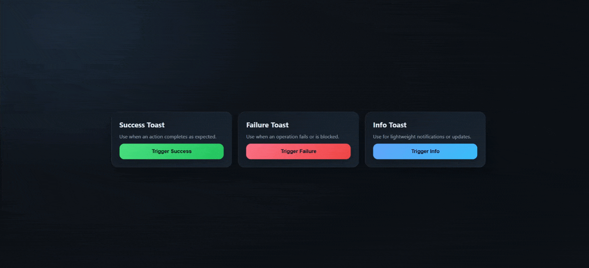
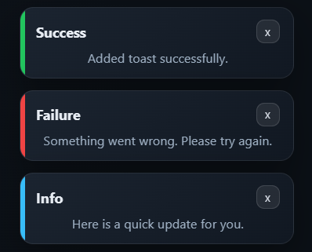
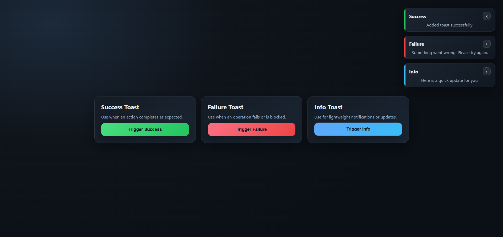

# React Toast Queue

A lightweight toast notification system powered by React Context with timed auto-dismiss.



## Install

```bash
npm install react-toast-queue
```

## Usage

```tsx
import { ToastContextProvider, ToastTypes, useToast } from "react-toast-queue";
import "react-toast-queue/styles.css";

const SaveButton = () => {
  const { addToast } = useToast();

  return (
    <button
      onClick={() =>
        addToast({
          title: "Saved",
          type: ToastTypes.Success,
          description: "Your changes are live.",
        })
      }
    >
      Save
    </button>
  );
};

export const App = () => (
  <ToastContextProvider>
    <SaveButton />
  </ToastContextProvider>
);
```

## API

`addToast({ title, type, description, duration })`

- `title` (string, required)
- `type` (`ToastTypes.Success | ToastTypes.Failure | ToastTypes.Info`, optional; defaults to `ToastTypes.Info`)
- `description` (string, optional)
- `duration` (number in ms, optional; default `5000`)

## Behavior

- Each toast auto-dismisses `duration` ms after it is created.
- Manual close removes the toast immediately.

## Local demo

The demo is a Vite app in `demo/` and imports the library source directly.

```bash
cd demo
npm install
npm run dev
```

## Screenshots



